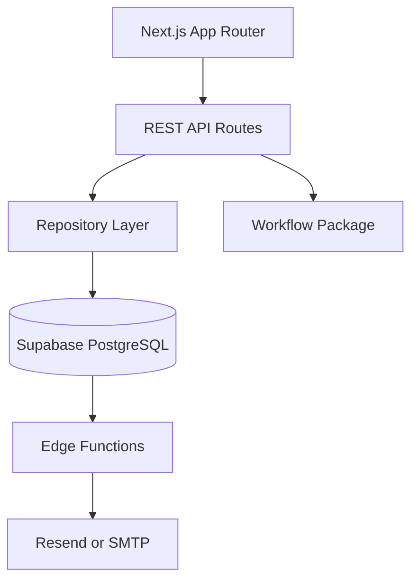

# Architecture

```mermaid
graph TD
  UI[Next.js App Router] --> API[REST API Routes]
  API --> Repo[Repository Layer]
  Repo --> Supabase[(Supabase PostgreSQL)]
  API --> Workflow[Workflow Package]
  Supabase --> Edge[Edge Functions]
  Edge --> Email[Resend or SMTP]
```
