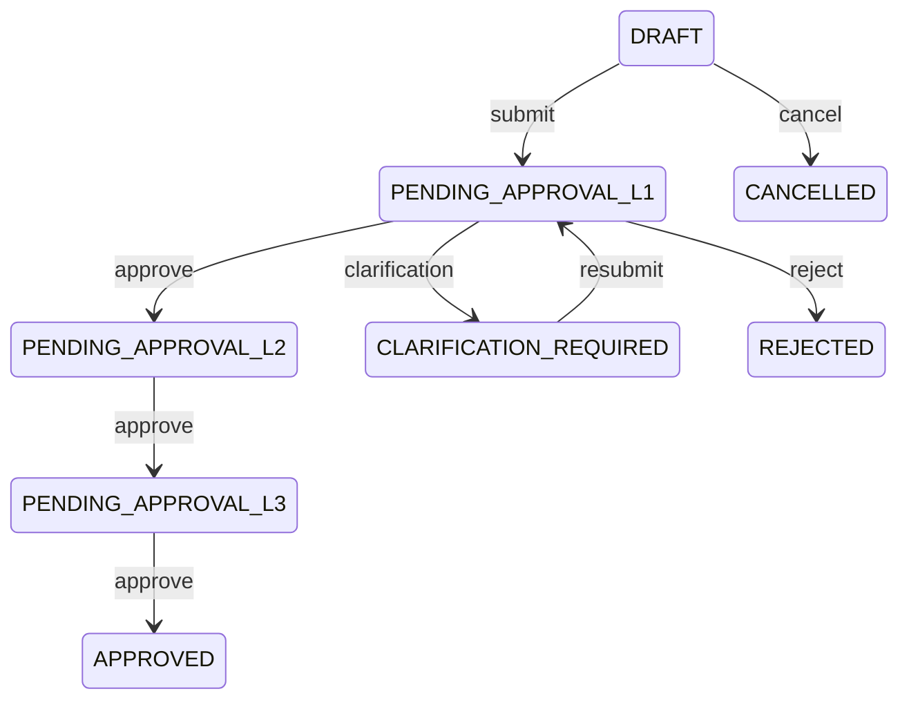

# Workflow

```mermaid
stateDiagram-v2
DRAFT --> PENDING_APPROVAL_L1: submit
PENDING_APPROVAL_L1 --> PENDING_APPROVAL_L2: approve
PENDING_APPROVAL_L2 --> PENDING_APPROVAL_L3: approve
PENDING_APPROVAL_L3 --> APPROVED: approve
PENDING_APPROVAL_L1 --> CLARIFICATION_REQUIRED: clarification
CLARIFICATION_REQUIRED --> PENDING_APPROVAL_L1: resubmit
PENDING_APPROVAL_L1 --> REJECTED: reject
DRAFT --> CANCELLED: cancel
```
